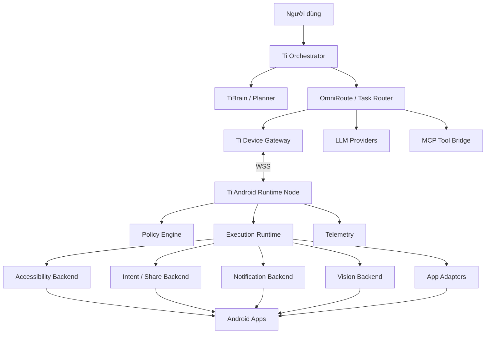
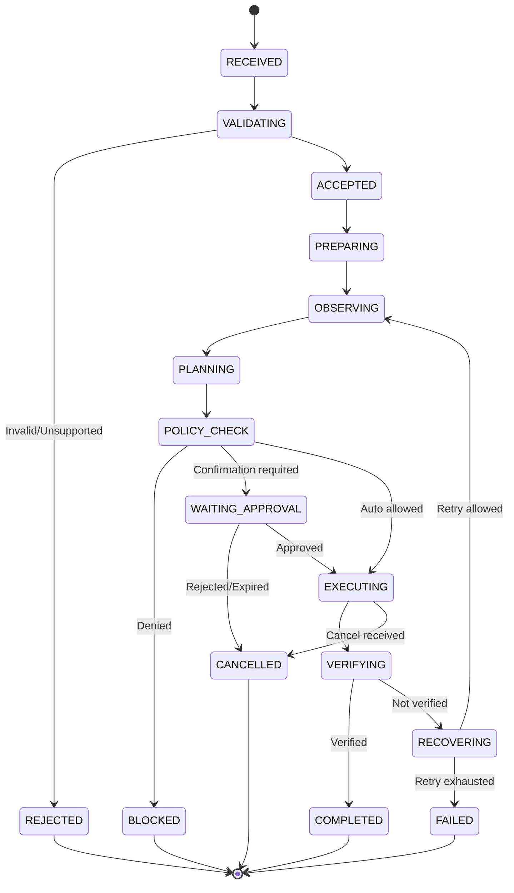
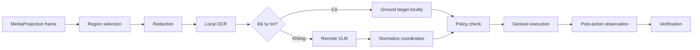

# KẾ HOẠCH TRIỂN KHAI TI ANDROID RUNTIME NODE

> **Tên dự án:** Ti Android Runtime Node  
> **Tên thư mục đề xuất:** `Z:\01_PROJECTS\apps\Ti-Android`  
> **Tên file:** `PLAN.md`  
> **Phiên bản kế hoạch:** 1.0  
> **Trạng thái:** Sẵn sàng khởi tạo dự án  
> **Ngôn ngữ triển khai chính:** Kotlin  
> **UI:** Jetpack Compose  
> **Mục tiêu phân phối ban đầu:** APK nội bộ / private distribution  
> **Nguyên tắc:** Accessibility-first, Vision fallback, policy-controlled, observable, recoverable

---

## 1. Tóm tắt điều hành

Ti Android Runtime Node là một ứng dụng Android đóng vai trò **mobile execution node** trong hệ sinh thái Ti. Ứng dụng nhận tác vụ từ Ti Device Gateway hoặc OmniRoute, quan sát giao diện ứng dụng Android, đề xuất hành động, yêu cầu xác nhận khi cần, thực thi hành động và gửi kết quả cùng telemetry về hệ thống trung tâm.

Ứng dụng không được thiết kế như một “API không chính thức” cho mọi app Android. Mỗi khả năng phải được công bố theo capability thực tế của thiết bị, phiên bản Android, quyền đã cấp và adapter của ứng dụng đích.

Kiến trúc mục tiêu:

```text
Ti Orchestrator / TiBrain
          │
          ▼
OmniRoute / Task Router
          │
          ▼
Ti Device Gateway
          │ WSS
          ▼
Ti Android Runtime Node
          │
          ├── Accessibility Tree
          ├── Intent / Share / Deep Link
          ├── Notification Listener
          ├── MediaProjection + OCR/VLM
          └── App-specific Adapters
```

MVP tập trung vào:

1. Đăng ký thiết bị và capability.
2. Kết nối WSS có reconnect, heartbeat và acknowledgment.
3. Accessibility Inspector.
4. Generic UI executor.
5. Một adapter ứng dụng duy nhất.
6. Soạn nội dung nhưng yêu cầu xác nhận trước khi gửi.
7. Audit log, snapshot trước/sau và khả năng dừng an toàn.

---

## 2. Bối cảnh và vấn đề cần giải quyết

Hệ Ti hiện khai thác LLM và công cụ chủ yếu qua trình duyệt hoặc runtime trên PC. Cách này mạnh ở DOM, filesystem, CLI và multi-tab nhưng không tiếp cận tốt các ngữ cảnh chỉ tồn tại trên điện thoại:

- Ứng dụng nhắn tin di động.
- Notification.
- Camera và ảnh mới chụp.
- Android Sharesheet.
- Ứng dụng chỉ có bản mobile.
- Luồng thao tác yêu cầu thiết bị thật.
- Điều khiển PC từ điện thoại và ngược lại.

Android Runtime Node bổ sung một lớp thực thi di động, nhưng không thay thế PC runtime.

### 2.1 Vấn đề kỹ thuật

Android không cung cấp DOM chung cho mọi ứng dụng. Mỗi app chạy trong sandbox riêng và chỉ công bố một phần giao diện qua accessibility tree. Vì vậy, hệ thống phải kết hợp nhiều backend quan sát và hành động:

```text
Accessibility Tree
    → OCR cục bộ
    → Visual grounding bằng VLM
    → Yêu cầu người dùng hỗ trợ hoặc dừng an toàn
```

### 2.2 Vấn đề vận hành

Một mobile agent thực tế phải xử lý:

- Mất mạng.
- App đích thay đổi giao diện.
- Keyboard che nội dung.
- Device lock.
- Permission bị thu hồi.
- Android kill background process.
- Orientation hoặc kích thước màn hình thay đổi.
- Task bị gửi lặp.
- Action đã thực thi nhưng acknowledgment bị mất.
- Model đề xuất hành động không chắc chắn.

Kế hoạch này coi recovery, idempotency, audit và policy là thành phần bắt buộc, không phải phần bổ sung.

---

## 3. Mục tiêu

### 3.1 Mục tiêu chính

- Xây dựng một APK Android native kết nối an toàn với Ti eco.
- Nhận và thực thi task có cấu trúc từ Device Gateway.
- Quan sát UI bằng accessibility tree trước, vision sau.
- Cho phép adapter riêng cho từng ứng dụng Android.
- Tách biệt orchestration, business logic, tool bridge và local execution.
- Cung cấp trạng thái task rõ ràng, có trace và audit.
- Yêu cầu xác nhận trước hành động có tác động ra bên ngoài.
- Không báo cáo capability hoặc model không thể xác minh.
- Có thể hoạt động độc lập với MCP trong control path.
- Dễ mở rộng thành device farm hoặc multi-device runtime.

### 3.2 Mục tiêu phụ

- Nhận nội dung qua Android Sharesheet.
- Đọc notification theo quyền người dùng.
- Cho phép người dùng duyệt task và approval trên điện thoại.
- Hỗ trợ local OCR để giảm chi phí gửi ảnh lên cloud.
- Có replay dữ liệu quan sát đã được làm sạch để debug adapter.
- Cung cấp SDK nội bộ để viết adapter mới.

---

## 4. Ngoài phạm vi phiên bản đầu

MVP không triển khai:

- Điều khiển tài chính hoặc tự xác nhận thanh toán.
- Đọc, lưu hoặc tự động nhập OTP.
- Thu thập mật khẩu, cookie, token hoặc thông tin đăng nhập.
- Tự động gửi tin nhắn hàng loạt.
- Tự động đăng nội dung công khai không có approval.
- Root device như một yêu cầu bắt buộc.
- Shizuku hoặc ADB làm backend mặc định.
- Hỗ trợ đồng thời nhiều app ngay trong sprint đầu.
- Chạy VLM liên tục trên từng frame màn hình.
- Nhúng toàn bộ planner LLM vào APK.
- Dùng MCP làm giao thức quản lý session thiết bị.
- Giả lập streaming hoặc tool-calling khi app đích không có các khả năng đó.

---

## 5. Nguyên tắc kiến trúc

### 5.1 Android Node chỉ là executor

Android Node không quyết định source of truth cho:

- Provider registry.
- Model registry.
- Chính sách toàn hệ thống.
- User identity.
- Task ownership.
- Long-term memory.

Node chỉ báo cáo trạng thái và capability thực tế.

### 5.2 Control channel tách khỏi MCP

MCP phù hợp cho tool invocation, không phù hợp làm device session manager. Control channel cần:

- Persistent connection.
- Device registration.
- Heartbeat.
- Reconnect.
- Task acknowledgment.
- Cancellation.
- Idempotency.
- Session revocation.
- Telemetry streaming.

Do đó dùng WSS hoặc HTTPS long polling thông qua Ti Device Gateway.

### 5.3 Quan sát trước, hành động sau

Mọi action phải đi theo vòng lặp:

```text
Observe
→ Normalize
→ Plan
→ Validate Policy
→ Approve nếu cần
→ Execute
→ Observe lại
→ Verify
→ Commit kết quả hoặc Recover
```

### 5.4 Không dùng tọa độ cố định làm locator chính

Thứ tự ưu tiên locator:

```text
resourceId
→ role/class
→ text/contentDescription
→ structural relation
→ normalized visual coordinates
→ fail safely
```

### 5.5 Capability-driven

Gateway chỉ gửi task phù hợp với capability hiện tại của node.

Ví dụ:

```json
{
  "accessibilityTree": true,
  "setText": true,
  "performNodeAction": true,
  "dispatchGesture": true,
  "mediaProjection": false,
  "notificationRead": true,
  "shareTarget": true,
  "visionGrounding": "remote",
  "deviceLocked": false
}
```

### 5.6 Human-in-the-loop theo mức rủi ro

Các hành động như gửi tin nhắn, đăng nội dung, thay đổi dữ liệu hoặc chia sẻ tệp phải qua Approval Gateway theo policy.

---

## 6. Phạm vi use case

### 6.1 Nhóm P0 — bắt buộc cho MVP

- Đăng ký thiết bị.
- Báo capability.
- Nhận task từ Gateway.
- Mở app bằng package hoặc deep link.
- Chụp accessibility tree.
- Tìm node bằng locator.
- Click node.
- Nhập văn bản.
- Scroll.
- Back và Home.
- Snapshot trước và sau action.
- Soạn bản nháp tin nhắn.
- Yêu cầu người dùng xác nhận.
- Gửi sau khi được xác nhận.
- Xác minh kết quả.
- Hủy task từ server hoặc thiết bị.
- Retry có giới hạn.
- Ghi local audit log.

### 6.2 Nhóm P1 — sau MVP

- Android Sharesheet.
- Notification Listener.
- OCR cục bộ.
- MediaProjection.
- Visual grounding fallback.
- Adapter versioning.
- App compatibility matrix.
- Offline task queue giới hạn.
- Dashboard xem thiết bị và task.
- Remote log collection có kiểm soát.

### 6.3 Nhóm P2 — mở rộng

- Nhiều thiết bị.
- Device groups.
- Managed devices.
- Device farm.
- Scheduled task.
- On-device small model.
- Voice input.
- Camera capture workflow.
- Cross-device handoff.
- ADB backend cho môi trường kiểm thử.
- Replay và benchmark adapter tự động.

---

## 7. Kiến trúc tổng thể



### 7.1 Phân tách trách nhiệm

| Thành phần | Trách nhiệm |
|---|---|
| Ti Orchestrator | Nhận mục tiêu, phân rã công việc, quản lý workflow |
| TiBrain | Lập kế hoạch, context, reasoning, memory |
| OmniRoute | Chọn provider, route task, quản lý runtime registry |
| Device Gateway | Session thiết bị, WSS, heartbeat, task delivery |
| MCP Tool Bridge | Cung cấp tools; không quản lý vòng đời thiết bị |
| Android Runtime Node | Quan sát và thực thi local |
| App Adapter | Biết cách thao tác app đích |
| Policy Engine | Chặn, cho phép hoặc yêu cầu approval |
| Telemetry Pipeline | Trace, event, metric, audit, sanitized snapshots |

---

## 8. Cấu trúc repository

```text
Ti-Android/
├── README.md
├── PLAN.md
├── settings.gradle.kts
├── build.gradle.kts
├── gradle.properties
├── config/
│   ├── dev.properties.example
│   ├── staging.properties.example
│   └── policy-default.yaml
├── app/
│   ├── src/main/
│   │   ├── AndroidManifest.xml
│   │   ├── java/.../app/
│   │   └── res/
│   └── build.gradle.kts
├── core-model/
│   ├── task/
│   ├── capability/
│   ├── event/
│   ├── action/
│   └── observation/
├── runtime-core/
│   ├── TaskRuntime.kt
│   ├── TaskStateMachine.kt
│   ├── ActionPipeline.kt
│   ├── VerificationEngine.kt
│   └── RecoveryCoordinator.kt
├── transport/
│   ├── DeviceGatewayClient.kt
│   ├── WebSocketSession.kt
│   ├── HeartbeatManager.kt
│   ├── MessageOutbox.kt
│   └── ReconnectPolicy.kt
├── accessibility-runtime/
│   ├── TiAccessibilityService.kt
│   ├── NodeSnapshotter.kt
│   ├── NodeNormalizer.kt
│   ├── NodeMatcher.kt
│   ├── NodeActionExecutor.kt
│   └── GestureExecutor.kt
├── vision-runtime/
│   ├── ProjectionForegroundService.kt
│   ├── FrameSampler.kt
│   ├── ImageRedactor.kt
│   ├── OcrEngine.kt
│   └── VisionGroundingClient.kt
├── intent-runtime/
│   ├── AppLauncher.kt
│   ├── DeepLinkExecutor.kt
│   ├── ShareReceiver.kt
│   └── ShareSender.kt
├── notification-runtime/
│   ├── TiNotificationListener.kt
│   ├── NotificationNormalizer.kt
│   └── NotificationPolicy.kt
├── adapter-sdk/
│   ├── AppAdapter.kt
│   ├── UiTarget.kt
│   ├── AdapterContext.kt
│   ├── AdapterResult.kt
│   └── AdapterRegistry.kt
├── adapters/
│   ├── generic/
│   └── telegram/
├── policy-engine/
│   ├── PolicyEvaluator.kt
│   ├── RiskClassifier.kt
│   ├── ApprovalGateway.kt
│   └── SensitiveDataGuard.kt
├── secure-storage/
│   ├── DeviceIdentityStore.kt
│   ├── SecretStore.kt
│   └── SessionTokenStore.kt
├── persistence/
│   ├── AppDatabase.kt
│   ├── TaskDao.kt
│   ├── EventDao.kt
│   └── OutboxDao.kt
├── telemetry/
│   ├── TraceContext.kt
│   ├── EventLogger.kt
│   ├── Metrics.kt
│   ├── AuditExporter.kt
│   └── SnapshotSanitizer.kt
├── testing/
│   ├── fake-gateway/
│   ├── fixture-app/
│   ├── accessibility-dumps/
│   └── replay-runner/
├── docs/
│   ├── ARCHITECTURE.md
│   ├── PROTOCOL.md
│   ├── SECURITY.md
│   ├── ADAPTER_GUIDE.md
│   └── TESTING.md
└── .github/
    └── workflows/
```

Trong giai đoạn đầu có thể dùng một Gradle module cho mỗi nhóm lớn. Không nên tách quá nhiều module trước khi dependency boundary ổn định.

---

## 9. Công nghệ khuyến nghị

| Hạng mục | Công nghệ |
|---|---|
| Ngôn ngữ | Kotlin |
| UI | Jetpack Compose |
| Async | Kotlin Coroutines + Flow |
| Dependency Injection | Hilt hoặc Koin |
| Networking | OkHttp WebSocket + Retrofit |
| Serialization | Kotlinx Serialization |
| Local DB | Room |
| Secure storage | Android Keystore + Encrypted storage |
| Background work | Foreground Service + WorkManager theo use case |
| Logging | Timber hoặc structured logger nội bộ |
| Metrics | OpenTelemetry-compatible event schema |
| OCR | ML Kit Text Recognition hoặc OCR engine local phù hợp |
| Image processing | Android Bitmap APIs; OpenCV chỉ khi thật sự cần |
| Testing | JUnit, MockK, Turbine, Robolectric, Espresso, UI Automator |
| Build | Gradle Kotlin DSL |
| CI | GitHub Actions hoặc CI nội bộ |
| Release | Signed internal APK/AAB |

### 9.1 Vì sao chọn Native Kotlin

- AccessibilityService là Android-native.
- MediaProjection phụ thuộc lifecycle và foreground service.
- Notification Listener là Android-native.
- Ít bridge hơn Flutter hoặc React Native.
- Dễ kiểm soát performance, permission và process death.
- Dễ viết instrumentation test và debug service.

Flutter hoặc React Native chỉ nên dùng khi cần chia sẻ UI với nền tảng khác; không nên dùng cho runtime core.

---

## 10. Cấu hình endpoint

Không hard-code port hoặc URL trong source code.

```properties
TI_ENV=dev
TI_DEVICE_GATEWAY_WSS=wss://gateway.example.local/device
TI_DEVICE_GATEWAY_HTTPS=https://gateway.example.local
TI_ROUTER_BASE_URL=http://router-host:PORT
TI_MCP_BASE_URL=http://mcp-host:PORT
TI_DEVICE_ID=
TI_LOG_LEVEL=INFO
TI_ALLOW_REMOTE_VISION=false
TI_REQUIRE_APPROVAL_FOR_SEND=true
```

### 10.1 Quy tắc endpoint

- `Device Gateway` là endpoint bắt buộc.
- `Router` có thể chỉ được Gateway sử dụng; APK không nhất thiết gọi trực tiếp.
- `MCP` là optional tool bridge.
- Port thực tế phải được kiểm tra tại thời điểm triển khai.
- Không mặc định port cũ đang active.
- Secrets không được commit vào repository.
- Development endpoint phải cho phép thay đổi qua settings hoặc build config.

---

## 11. Device registration và identity

### 11.1 Đăng ký lần đầu

```text
Cài APK
→ Mở ứng dụng
→ Tạo device key pair trong Android Keystore
→ Hiển thị pairing code hoặc QR
→ Người dùng xác nhận trên Ti Dashboard
→ Gateway cấp session credential ngắn hạn
→ Node đăng ký capability
```

### 11.2 Device identity

```json
{
  "deviceId": "ti-android-01",
  "installationId": "uuid",
  "deviceName": "Dev Phone",
  "platform": "android",
  "androidApiLevel": 35,
  "appVersion": "0.1.0",
  "publicKey": "base64-public-key",
  "attestation": {
    "type": "none",
    "status": "not_configured"
  }
}
```

Không dùng IMEI, serial phần cứng hoặc identifier nhạy cảm làm device ID.

### 11.3 Session

- Access token ngắn hạn.
- Refresh bằng device credential hoặc signed challenge.
- Gateway có thể revoke thiết bị.
- Mỗi message có sequence number và timestamp.
- Chống replay bằng nonce hoặc signed envelope khi cần.

---

## 12. Capability Registry

### 12.1 Capability phải phản ánh trạng thái sống

```json
{
  "deviceId": "ti-android-01",
  "reportedAt": "2026-06-29T15:00:00Z",
  "capabilities": {
    "accessibility": {
      "enabled": true,
      "retrieveWindowContent": true,
      "performNodeAction": true,
      "dispatchGesture": true
    },
    "mediaProjection": {
      "available": true,
      "active": false,
      "requiresUserConsent": true
    },
    "notifications": {
      "enabled": false
    },
    "shareTarget": {
      "enabled": true
    },
    "ocr": {
      "mode": "local",
      "languages": ["vi", "en"]
    },
    "visionGrounding": {
      "mode": "remote",
      "enabled": false
    }
  },
  "runtime": {
    "deviceLocked": false,
    "batteryPercent": 72,
    "network": "wifi",
    "foregroundApp": "org.telegram.messenger"
  }
}
```

### 12.2 Cập nhật capability khi

- Accessibility bật hoặc tắt.
- Permission thay đổi.
- MediaProjection bắt đầu hoặc kết thúc.
- Thiết bị lock hoặc unlock.
- Mạng thay đổi.
- App mục tiêu được cài hoặc gỡ.
- Adapter compatibility thay đổi.
- Node vào degraded mode.

---

## 13. Task protocol

### 13.1 Task envelope

```json
{
  "protocolVersion": "1.0",
  "messageId": "msg_01",
  "taskId": "task_01",
  "attempt": 1,
  "idempotencyKey": "compose-message:telegram:conversation-id:hash",
  "correlationId": "corr_01",
  "createdAt": "2026-06-29T15:00:00Z",
  "expiresAt": "2026-06-29T15:05:00Z",
  "target": {
    "deviceId": "ti-android-01",
    "packageName": "org.telegram.messenger",
    "adapter": "telegram",
    "minimumAdapterVersion": "0.1.0"
  },
  "intent": {
    "type": "compose_message",
    "parameters": {
      "conversation": "Dev Team",
      "content": "Bản build đã hoàn thành."
    }
  },
  "policy": {
    "allowVisionFallback": true,
    "sendRequiresApproval": true,
    "maximumActions": 20,
    "timeoutMs": 60000
  }
}
```

### 13.2 Task result

```json
{
  "taskId": "task_01",
  "attempt": 1,
  "status": "COMPLETED",
  "startedAt": "2026-06-29T15:00:03Z",
  "finishedAt": "2026-06-29T15:00:27Z",
  "result": {
    "draftCreated": true,
    "sent": true,
    "verification": "message_visible_in_conversation"
  },
  "metrics": {
    "actions": 7,
    "retries": 1,
    "visionCalls": 0
  },
  "traceId": "trace_01"
}
```

### 13.3 Message types

```text
device.register
device.registered
device.capabilities
device.heartbeat
device.status
task.offer
task.accept
task.reject
task.started
task.progress
task.approval_required
task.approval_result
task.completed
task.failed
task.cancel
event.batch
session.rotate
session.revoke
```

---

## 14. Task State Machine



### 14.1 Trạng thái lỗi chuẩn

```text
INVALID_TASK
UNSUPPORTED_CAPABILITY
APP_NOT_INSTALLED
ADAPTER_NOT_FOUND
ADAPTER_INCOMPATIBLE
PERMISSION_MISSING
DEVICE_LOCKED
TARGET_NOT_FOUND
UI_CHANGED
ACTION_REJECTED
ACTION_BLOCKED
USER_CANCELLED
APP_CRASHED
NETWORK_UNAVAILABLE
TIMEOUT
VERIFICATION_FAILED
RETRY_EXHAUSTED
INTERNAL_ERROR
```

---

## 15. Action model

### 15.1 Các action chuẩn

```kotlin
sealed interface DeviceAction {
    data class OpenApp(val packageName: String) : DeviceAction
    data class OpenDeepLink(val uri: String) : DeviceAction
    data class FindTarget(val target: UiTarget) : DeviceAction
    data class ClickTarget(val target: UiTarget) : DeviceAction
    data class SetText(val target: UiTarget, val text: String) : DeviceAction
    data class Scroll(val direction: Direction, val amount: Float) : DeviceAction
    data class Tap(val xRatio: Float, val yRatio: Float) : DeviceAction
    data class Swipe(
        val startXRatio: Float,
        val startYRatio: Float,
        val endXRatio: Float,
        val endYRatio: Float,
        val durationMs: Long
    ) : DeviceAction
    data object Back : DeviceAction
    data object Home : DeviceAction
    data class WaitFor(val condition: UiCondition, val timeoutMs: Long) : DeviceAction
}
```

### 15.2 Mỗi action phải có

- `actionId`.
- Precondition.
- Risk classification.
- Timeout.
- Retry policy.
- Expected postcondition.
- Observation before.
- Observation after.
- Execution backend.
- Verification result.

### 15.3 Action không được thực thi trực tiếp từ output LLM

Output planner phải được parse thành action schema, validate và kiểm tra policy trước khi đưa vào executor.

---

## 16. Observation model

### 16.1 Accessibility snapshot

```json
{
  "packageName": "org.telegram.messenger",
  "windowId": 12,
  "orientation": "portrait",
  "screen": {
    "width": 1080,
    "height": 2400,
    "density": 2.75
  },
  "nodes": [
    {
      "nodeId": "n-001",
      "className": "android.widget.EditText",
      "resourceId": "org.telegram.messenger:id/chat_input",
      "text": "",
      "contentDescription": null,
      "clickable": true,
      "editable": true,
      "visible": true,
      "bounds": [24, 2100, 900, 2240],
      "children": []
    }
  ]
}
```

### 16.2 Chuẩn hóa dữ liệu

- Loại node vô hình.
- Giới hạn depth.
- Loại duplicate.
- Hash text nhạy cảm trong log.
- Không gửi toàn bộ tree nếu chỉ cần region nhỏ.
- Gắn stable hints nhưng không giả định node ID tồn tại qua phiên.
- Thêm semantic role khi suy ra được từ class/action.

### 16.3 Visual snapshot

Visual snapshot phải qua redaction trước khi rời thiết bị:

- Password fields.
- OTP.
- Notification nhạy cảm.
- Ảnh cá nhân khi không cần thiết.
- Khu vực được đánh dấu private.
- App thuộc denylist.

---

## 17. Locator và UiTarget

```kotlin
data class UiTarget(
    val resourceIds: List<String> = emptyList(),
    val textPatterns: List<Regex> = emptyList(),
    val contentDescriptions: List<String> = emptyList(),
    val classNames: List<String> = emptyList(),
    val requiredActions: Set<String> = emptySet(),
    val ancestorHints: List<TargetHint> = emptyList(),
    val siblingHints: List<TargetHint> = emptyList(),
    val relativePosition: RelativePosition? = null,
    val visualFallback: VisualTarget? = null,
    val minimumConfidence: Double = 0.85
)
```

### 17.1 Scoring locator

```text
resourceId exact                  +50
contentDescription exact          +30
text exact                        +25
text regex                        +18
class match                       +10
required action match             +10
ancestor/sibling structural match +15
visible and enabled               +10
bounds plausible                   +5
multiple ambiguous candidates     -25
stale node                         -100
```

Chỉ action khi score vượt threshold và không có ambiguity nghiêm trọng.

---

## 18. Adapter SDK

### 18.1 Interface

```kotlin
interface AppAdapter {
    val id: String
    val version: String
    val supportedPackages: Set<String>

    suspend fun probe(context: AdapterContext): CompatibilityResult
    suspend fun observe(context: AdapterContext): AdapterObservation
    suspend fun plan(
        intent: TaskIntent,
        observation: AdapterObservation
    ): AdapterPlan
    suspend fun verify(
        plan: AdapterPlan,
        before: AdapterObservation,
        after: AdapterObservation
    ): VerificationResult
}
```

### 18.2 Adapter không được

- Truy cập trực tiếp transport.
- Tự gửi telemetry ra ngoài.
- Bỏ qua Policy Engine.
- Truy cập secret store.
- Thực thi action ngoài Action Pipeline.
- Tự giả định task thành công.
- Dùng tọa độ pixel cố định làm duy nhất locator.

### 18.3 Adapter compatibility manifest

```yaml
adapterId: telegram
version: 0.1.0
packages:
  - org.telegram.messenger
supportedAppVersions:
  min: "10.0.0"
  maxTested: "unknown"
supportedIntents:
  - open_conversation
  - read_visible_messages
  - compose_message
  - send_message
requirements:
  accessibility: true
  visionFallback: optional
risk:
  send_message: confirm
```

---

## 19. Adapter MVP

Chỉ chọn một app cho bản đầu. Khuyến nghị dùng app có accessibility tree tương đối ổn định và môi trường test riêng.

### 19.1 Chức năng adapter đầu tiên

```text
probe_app
open_app
open_conversation
read_visible_content
locate_input
compose_draft
request_send_approval
send_after_approval
verify_sent
```

### 19.2 Không làm ngay

- Đọc toàn bộ lịch sử.
- Gửi attachment phức tạp.
- Gọi thoại/video.
- Quản trị nhóm.
- Gửi hàng loạt.
- Tương tác tài khoản.
- Tự xử lý CAPTCHA hoặc xác minh bảo mật.

---

## 20. Vision fallback

### 20.1 Pipeline



### 20.2 Quy tắc chi phí và riêng tư

- Không stream toàn màn hình liên tục.
- Chỉ capture khi accessibility không đủ.
- Ưu tiên region-of-interest.
- OCR local trước.
- VLM remote là opt-in.
- Frame phải được redaction.
- Không lưu frame mặc định.
- Debug snapshot phải có thời hạn tự xóa.
- Ghi hash và metadata thay cho ảnh khi có thể.

### 20.3 MediaProjection lifecycle

- Người dùng chủ động cấp quyền capture.
- Mỗi phiên được quản lý rõ ràng.
- Hiển thị foreground notification.
- Dừng capture ngay khi task hoàn tất.
- Xử lý callback khi người dùng dừng chia sẻ.
- Không coi MediaProjection là backend click; gesture vẫn do Accessibility Executor hoặc backend được phép thực hiện.

---

## 21. Policy Engine

### 21.1 Mức rủi ro

| Mức | Ví dụ | Hành vi mặc định |
|---|---|---|
| R0 | Đọc trạng thái app, chụp tree đã làm sạch | Cho phép |
| R1 | Mở app, điều hướng, scroll | Cho phép có log |
| R2 | Điền bản nháp, chọn tệp chưa gửi | Cho phép có preview |
| R3 | Gửi tin nhắn, đăng nội dung, chia sẻ file | Yêu cầu xác nhận |
| R4 | Xóa dữ liệu, thay đổi tài khoản, gửi hàng loạt | Chặn mặc định |
| R5 | Thanh toán, chuyển tiền, OTP, credential | Từ chối |

### 21.2 Policy mặc định

```yaml
version: 1
defaults:
  read_ui: allow
  open_app: allow
  navigate: allow
  type_draft: allow
  send_message: confirm
  publish_content: confirm
  share_file: confirm
  delete_content: deny
  account_change: deny
  bulk_message: deny
  financial_action: deny
  credential_action: deny
  otp_action: deny
limits:
  max_actions_per_task: 30
  max_retries_per_action: 2
  max_task_duration_seconds: 120
  max_remote_vision_calls: 3
```

### 21.3 Approval payload

Approval UI phải hiển thị:

- Task đang làm gì.
- App đích.
- Nội dung sắp gửi hoặc thay đổi.
- Recipient hoặc destination nếu xác định được.
- Dữ liệu/tệp liên quan.
- Nút Approve.
- Nút Reject.
- Nút Cancel task.
- Thời gian hết hạn.

---

## 22. Bảo mật và quyền riêng tư

### 22.1 Nguyên tắc

- Least privilege.
- Explicit consent.
- Data minimization.
- Local-first processing.
- Short-lived credentials.
- Auditability.
- Revocation.
- Secure defaults.
- Không thu thập dữ liệu không liên quan.

### 22.2 Secret management

- Device private key nằm trong Android Keystore.
- Không log access token.
- Không lưu token dạng plain text.
- Session token có thời hạn.
- Có remote revoke.
- Không lưu API key LLM trong adapter.
- LLM credentials nằm ở Router hoặc Gateway, trừ chế độ standalone được thiết kế riêng.

### 22.3 Network

- Chỉ dùng TLS/WSS ngoài môi trường loopback test.
- Certificate pinning có thể bật cho bản managed.
- Có message sequence và replay protection.
- Giới hạn payload.
- Validate schema.
- Reject task hết hạn.
- Rate limit task và event.

### 22.4 Sensitive Data Guard

Phát hiện và loại bỏ:

- Password fields.
- OTP.
- Payment card data.
- Access token.
- Private key.
- Session cookie.
- Nội dung từ app denylist.
- Field được đánh dấu `password=true`.
- Window có chính sách bảo vệ hoặc không thể capture hợp lệ.

---

## 23. Reliability và recovery

### 23.1 Reconnect

```text
Disconnected
→ Retry nhanh 1s
→ 2s
→ 5s
→ 10s
→ 30s
→ 60s tối đa
```

Thêm jitter để tránh nhiều thiết bị reconnect đồng thời.

### 23.2 Outbox pattern

Event quan trọng lưu vào Room trước khi gửi:

```text
Persist event
→ Send
→ Nhận ACK
→ Mark delivered
→ Cleanup theo retention
```

### 23.3 Idempotency

- Task có `idempotencyKey`.
- Node lưu task đã hoàn thành trong retention window.
- Task lặp không được gửi lại nội dung hoặc thực thi action có side effect.
- Side-effect action cần verification trước khi retry.
- Nếu không xác định đã gửi hay chưa, chuyển sang `NEEDS_REVIEW`, không tự gửi lại.

### 23.4 Recovery strategy

| Lỗi | Recovery |
|---|---|
| Node không tìm thấy target | Refresh tree, scroll có giới hạn, vision fallback |
| App bị đóng | Mở lại app và khôi phục step an toàn |
| Keyboard che target | Back/close keyboard rồi observe lại |
| UI version thay đổi | Dừng adapter, ghi compatibility issue |
| Mất mạng | Tiếp tục action local chỉ khi policy cho phép; queue result |
| Device lock | Pause và yêu cầu unlock |
| Permission bị tắt | Fail với hướng dẫn rõ ràng |
| Verification không chắc chắn | Không retry side effect; yêu cầu review |
| Task bị cancel | Dừng tại safe point gần nhất |

---

## 24. Observability

### 24.1 Trace model

Mỗi task có:

- `correlationId`.
- `traceId`.
- `taskId`.
- `attempt`.
- `actionId`.
- `deviceId`.
- `adapterId`.
- `adapterVersion`.

### 24.2 Event schema

```json
{
  "event": "action.completed",
  "timestamp": "2026-06-29T15:00:12Z",
  "traceId": "trace_01",
  "taskId": "task_01",
  "actionId": "action_04",
  "deviceId": "ti-android-01",
  "adapterId": "telegram",
  "backend": "accessibility",
  "durationMs": 342,
  "outcome": "success",
  "metadata": {
    "locatorType": "resourceId",
    "confidence": 0.98
  }
}
```

### 24.3 Metrics chính

- Online device count.
- WSS reconnect count.
- Task success rate.
- Task duration P50/P95.
- Action success rate.
- Locator ambiguity rate.
- Vision fallback rate.
- Approval latency.
- User rejection rate.
- Adapter incompatibility rate.
- Retry rate.
- Verification failure rate.
- Battery impact.
- Crash-free sessions.

### 24.4 Log level

```text
ERROR: crash, security, unrecoverable task
WARN: retry, degraded capability, ambiguous locator
INFO: task lifecycle, approval, connection
DEBUG: sanitized node matching details
TRACE: chỉ bật cục bộ, không dùng production mặc định
```

---

## 25. UI của Android app

### 25.1 Màn hình chính

- Trạng thái kết nối.
- Device ID.
- Gateway hiện tại.
- Accessibility status.
- Screen capture status.
- Notification access status.
- Task đang chạy.
- Nút Pause Agent.
- Nút Emergency Stop.
- Nút xem audit gần nhất.

### 25.2 Onboarding

```text
1. Giới thiệu chức năng
2. Pair thiết bị
3. Cấp quyền cần thiết theo từng use case
4. Kiểm tra Accessibility
5. Test action không có side effect
6. Chọn policy mặc định
7. Hoàn tất
```

Không yêu cầu tất cả permission ngay lần đầu. Chỉ yêu cầu theo tính năng.

### 25.3 Accessibility Inspector

- Hiển thị package hiện tại.
- Dump tree.
- Search node.
- Highlight bounds.
- Xem resource ID, text, class, action.
- Test click.
- Test setText.
- Export sanitized snapshot.
- So sánh snapshot trước/sau.
- Tạo locator draft cho adapter.

---

## 26. Gateway API đề xuất

### 26.1 REST

```text
POST   /v1/devices/pair
POST   /v1/devices/register
POST   /v1/devices/{id}/refresh-session
GET    /v1/devices/{id}
POST   /v1/devices/{id}/revoke
GET    /v1/devices/{id}/tasks
POST   /v1/tasks/{id}/approval
POST   /v1/tasks/{id}/cancel
GET    /v1/tasks/{id}/trace
```

### 26.2 WebSocket

```text
GET /v1/device-session
Authorization: Bearer <short-lived-token>
X-Ti-Device-Id: <device-id>
X-Ti-Protocol-Version: 1.0
```

### 26.3 Gateway responsibilities

- Authenticate device.
- Maintain online presence.
- Route task.
- Enforce task expiry.
- Store task state.
- Deduplicate messages.
- Fan-out telemetry.
- Handle cancellation.
- Rotate session.
- Expose dashboard state.
- Không chứa adapter logic.

---

## 27. Tích hợp OmniRoute, TiBrain và MCP

### 27.1 OmniRoute

- Quản lý runtime registry.
- Chọn Android node theo capability.
- Route task.
- Không thực thi gesture.
- Không truy cập accessibility tree trực tiếp ngoài dữ liệu đã được làm sạch.

### 27.2 TiBrain

- Chuyển mục tiêu thành task intent.
- Duy trì context.
- Đề xuất plan.
- Không được bypass Policy Engine.
- Không coi output model là action đã được tin cậy.

### 27.3 MCP

MCP chỉ dùng khi Android workflow cần tool bên ngoài:

- Đọc file được phép.
- Gọi dịch vụ nội bộ.
- Tra cứu dữ liệu.
- Kích hoạt workflow khác.

MCP không dùng để:

- Duy trì heartbeat thiết bị.
- Quản lý task state.
- Phân phối lệnh real-time.
- Lưu device session.
- Truyền screen frames liên tục.

---

## 28. Kế hoạch triển khai theo giai đoạn

## Giai đoạn 0 — Xác minh hạ tầng và quyết định nền tảng

### Mục tiêu

Chốt endpoint, repository và contract trước khi viết runtime.

### Công việc

- Kiểm tra trạng thái thực tế của Router, Gateway và MCP.
- Không giả định port cũ đang hoạt động.
- Chốt đường dẫn repository.
- Chốt package name Android.
- Chốt minSdk, targetSdk và compileSdk.
- Chốt cơ chế pairing.
- Chốt format task protocol v1.
- Chốt policy mặc định.
- Chọn app adapter đầu tiên.
- Tạo ADR cho các quyết định chính.

### Đầu ra

- Repository trống chạy được.
- `PLAN.md`.
- `ARCHITECTURE.md`.
- `PROTOCOL.md`.
- `SECURITY.md`.
- Contract JSON Schema.
- Decision log.

### Exit criteria

- Build debug thành công.
- Gateway mock chạy.
- Protocol v1 được đóng băng cho MVP.

---

## Giai đoạn 1 — Android app shell và device identity

### Công việc

- Tạo project Kotlin + Compose.
- Thiết lập DI.
- Tạo navigation.
- Tạo settings.
- Android Keystore identity.
- Pairing UI.
- Secure session storage.
- Connection status UI.
- Structured logging.
- Crash handling.

### Exit criteria

- Cài được APK.
- Pair được với fake gateway.
- Restart app vẫn giữ identity.
- Có thể revoke và pair lại.

---

## Giai đoạn 2 — Transport và task runtime

### Công việc

- WSS client.
- Heartbeat.
- Exponential backoff + jitter.
- Message serializer.
- Outbox.
- Task persistence.
- Task state machine.
- Cancellation.
- Timeout.
- Idempotency.
- Fake Gateway test harness.

### Exit criteria

- Mất mạng và nối lại không mất task event.
- Task duplicate không chạy lại side effect.
- Cancel dừng task tại safe point.
- Task state đồng bộ với Gateway.

---

## Giai đoạn 3 — Accessibility runtime và Inspector

### Công việc

- AccessibilityService.
- Window content retrieval.
- Node snapshot.
- Node normalization.
- Node matching.
- Node action.
- Gesture dispatch.
- Inspector UI.
- Highlight overlay.
- Sanitized export.
- Fixture app để test.

### Exit criteria

- Inspector đọc tree của fixture app.
- Click và setText thành công.
- Không log password field.
- Action có before/after snapshot.
- Service mất quyền được phát hiện và báo rõ.

---

## Giai đoạn 4 — Generic action pipeline

### Công việc

- Action schema.
- Preconditions.
- Policy check.
- Action executor.
- Postconditions.
- Verification engine.
- Retry policy.
- Recovery coordinator.
- Emergency stop.
- Approval Gateway UI.

### Exit criteria

- Chạy được workflow nhiều bước trên fixture app.
- Hành động send bị chặn nếu chưa approval.
- Retry không gây lặp side effect.
- Emergency stop hoạt động.

---

## Giai đoạn 5 — Adapter ứng dụng đầu tiên

### Công việc

- Adapter SDK.
- Compatibility probe.
- Locator catalog.
- Open app.
- Locate conversation.
- Read visible content.
- Compose draft.
- Approval.
- Send.
- Verify.
- App version matrix.
- Regression fixtures.

### Exit criteria

- Tỷ lệ thành công tối thiểu 90% trên bộ test được kiểm soát.
- Không gửi khi approval bị từ chối.
- UI thay đổi gây fail-safe, không click tùy ý.
- Có trace đầy đủ cho mỗi lần test.

---

## Giai đoạn 6 — Vision fallback

### Công việc

- MediaProjection foreground service.
- Consent flow.
- Frame sampler.
- ROI.
- Local OCR.
- Redaction.
- Remote VLM connector.
- Coordinate normalization.
- Visual target verification.
- Vision cost controls.

### Exit criteria

- Vision chỉ chạy khi accessibility không đủ.
- Không capture liên tục ngoài task.
- Frame nhạy cảm được redaction.
- Gesture dùng normalized coordinates.
- Post-action verification bắt buộc.

---

## Giai đoạn 7 — Ti eco integration

### Công việc

- Device Gateway thật.
- OmniRoute runtime registration.
- TiBrain task intent.
- Dashboard.
- Central telemetry.
- Remote task cancellation.
- Policy sync.
- Adapter manifest sync.
- Optional MCP tool bridge.

### Exit criteria

- Task end-to-end từ Ti → Gateway → Android → result.
- Dashboard thấy trạng thái thiết bị.
- Có approval round trip.
- Có trace xuyên hệ thống.
- MCP lỗi không làm mất control session.

---

## Giai đoạn 8 — Hardening và private release

### Công việc

- Threat model.
- Penetration review nội bộ.
- Battery profiling.
- Memory profiling.
- Process death tests.
- Network fault injection.
- Device matrix.
- Signed release.
- Rollback plan.
- Backup compatibility manifest.
- Data retention policy.
- User-facing permission disclosure.

### Exit criteria

- Không có lỗi P0/P1.
- Crash-free test sessions đạt mục tiêu.
- Battery impact trong ngưỡng chấp nhận.
- Release có signature và rollback.
- Policy, privacy và permission flow được rà soát.

---

## 29. Sprint đề xuất

### Sprint 1 — Foundation

- Khởi tạo repository.
- Build debug.
- App shell.
- Device identity.
- Fake Gateway.
- WSS connect.
- Heartbeat.
- Basic settings.

### Sprint 2 — Runtime

- Task protocol.
- Room persistence.
- State machine.
- Outbox.
- Cancellation.
- Retry.
- Trace.

### Sprint 3 — Accessibility

- Service.
- Tree snapshot.
- Inspector.
- Node matching.
- Click.
- SetText.
- Scroll.
- Fixture tests.

### Sprint 4 — Policy và action pipeline

- Action schema.
- Risk classifier.
- Approval UI.
- Verification.
- Recovery.
- Emergency stop.

### Sprint 5 — Adapter đầu tiên

- Adapter SDK.
- Compatibility probe.
- Draft workflow.
- Send approval.
- Verification.
- Regression tests.

### Sprint 6 — Vision và integration

- MediaProjection.
- OCR.
- Redaction.
- VLM fallback.
- Gateway thật.
- OmniRoute registration.
- End-to-end test.

---

## 30. Testing strategy

### 30.1 Unit test

- State transitions.
- Retry policy.
- Idempotency.
- Locator scoring.
- Policy evaluation.
- Sensitive data redaction.
- Serialization.
- Adapter plan generation.
- Verification conditions.

### 30.2 Integration test

- Fake Gateway ↔ Android Node.
- Reconnect.
- ACK loss.
- Duplicate task.
- Cancel during action.
- Process restart.
- Permission revoked.
- MediaProjection stopped.
- Outbox replay.

### 30.3 Instrumentation test

- Accessibility fixture app.
- Click.
- SetText.
- Scroll.
- Orientation change.
- Keyboard open/close.
- Multiple matching nodes.
- Node stale.
- App background/foreground.
- Device lock/unlock.

### 30.4 Adapter regression test

Mỗi app version được test phải lưu:

- Sanitized accessibility snapshots.
- Expected locator.
- Expected plan.
- Expected verification.
- Known limitations.

### 30.5 Fault injection

- Tắt Wi-Fi.
- Gateway trả lỗi.
- Token hết hạn.
- App crash.
- Android kill process.
- Tree rỗng.
- Screenshot unavailable.
- VLM timeout.
- Approval hết hạn.
- Task cancel.
- Duplicate side-effect task.

---

## 31. CI/CD

### 31.1 Pull request pipeline

```text
ktlint/detekt
→ unit tests
→ schema validation
→ debug build
→ dependency vulnerability scan
→ artifact upload
```

### 31.2 Main branch pipeline

```text
all PR checks
→ instrumentation tests trên emulator
→ signed internal debug/release candidate
→ changelog
→ publish artifact nội bộ
```

### 31.3 Release channels

- `dev`: debug, verbose logs, fake gateway.
- `internal`: signed APK, internal gateway.
- `staging`: production-like policy và telemetry.
- `production-private`: tối thiểu log, strict policy.

---

## 32. Distribution strategy

### 32.1 Giai đoạn đầu

APK nội bộ hoặc private distribution để:

- Thử nghiệm Accessibility.
- Thay đổi adapter nhanh.
- Không phụ thuộc quy trình public store.
- Kiểm soát thiết bị và người dùng thử.
- Đánh giá policy và permission.

### 32.2 Bản public trong tương lai

Nếu phát hành công khai, nên tách:

```text
Ti Android Companion
- Share target
- Approval
- Notification workflow có consent
- Không autonomous control toàn quyền

Ti Android Agent Internal
- Accessibility
- Vision fallback
- App adapters
- Device Gateway
- Automation policy
```

Phải kiểm tra chính sách Google Play tại thời điểm phát hành; không dựa vào tài liệu cũ.

---

## 33. Tiêu chí nghiệm thu MVP

### 33.1 Functional

- [ ] APK cài và mở được trên thiết bị mục tiêu.
- [ ] Pair với Gateway.
- [ ] Báo capability chính xác.
- [ ] WSS reconnect sau mất mạng.
- [ ] Nhận, accept và chạy task.
- [ ] Accessibility Inspector đọc tree.
- [ ] Click, setText, scroll hoạt động.
- [ ] Soạn được draft trong app đích.
- [ ] Gửi yêu cầu approval.
- [ ] Chỉ gửi sau approval.
- [ ] Verify được kết quả.
- [ ] Cancel task hoạt động.
- [ ] Emergency Stop hoạt động.

### 33.2 Reliability

- [ ] Duplicate task không tạo side effect lặp.
- [ ] Process restart khôi phục task state hợp lệ.
- [ ] Event quan trọng không mất khi offline.
- [ ] Timeout rõ ràng.
- [ ] Retry có giới hạn.
- [ ] Không retry mù sau side effect không xác định.

### 33.3 Security

- [ ] Secret lưu trong Keystore.
- [ ] Không log token.
- [ ] Không log password/OTP.
- [ ] Task hết hạn bị từ chối.
- [ ] Device có thể revoke.
- [ ] Remote vision mặc định tắt.
- [ ] Frame được redaction.
- [ ] Financial và credential action bị chặn.

### 33.4 Observability

- [ ] Mỗi task có trace ID.
- [ ] Mỗi action có before/after metadata.
- [ ] Gateway thấy task state.
- [ ] Có metrics success/failure/retry.
- [ ] Có sanitized diagnostic export.

---

## 34. Definition of Done

Một feature chỉ hoàn thành khi:

- Có code.
- Có unit test phù hợp.
- Có integration hoặc instrumentation test nếu liên quan Android service.
- Có structured log.
- Có error mapping.
- Có timeout.
- Có cancellation.
- Có policy classification.
- Có documentation.
- Không chứa secret.
- Không làm tăng coupling giữa adapter và transport.
- Đã test ít nhất một failure path.
- Đã self-check behavior sau process restart nếu có state.

---

## 35. Rủi ro và biện pháp giảm thiểu

| Rủi ro | Mức | Giảm thiểu |
|---|---:|---|
| App đích thay đổi UI | Cao | Adapter versioning, compatibility probe, regression snapshots |
| Accessibility tree thiếu dữ liệu | Cao | OCR/Vision fallback, fail-safe |
| Click nhầm do ambiguity | Cao | Confidence threshold, structural locator, approval |
| Side effect bị lặp | Cao | Idempotency, verification, `NEEDS_REVIEW` |
| Android kill process | Cao | Persistent state, foreground service khi hợp lệ |
| Mất mạng | Trung bình | Outbox, reconnect, task expiry |
| Tốn pin | Trung bình | Event-driven, frame throttling, stop capture |
| Rò rỉ dữ liệu màn hình | Cao | Redaction, opt-in, no default retention |
| Vi phạm store policy | Cao | Private distribution ban đầu, policy review |
| Gateway lỗi | Trung bình | Local safe stop, reconnect, không phụ thuộc MCP |
| LLM hallucination action | Cao | Schema validation, policy, deterministic executor |
| Adapter coupling | Trung bình | SDK boundary, dependency rules |
| Port/config drift | Trung bình | Environment config, startup health checks |

---

## 36. Health checks

### 36.1 Node self-check

- Gateway reachable.
- Token valid.
- Accessibility enabled.
- Required package installed.
- Adapter compatible.
- Device unlocked.
- Battery above threshold.
- Storage available.
- MediaProjection active nếu task yêu cầu.
- Notification access nếu task yêu cầu.

### 36.2 Readiness

Node chỉ nhận task khi:

```text
session == ACTIVE
AND emergencyStop == false
AND deviceState != LOCKED
AND requiredCapabilities satisfied
AND adapter compatible
```

---

## 37. Startup sequence

```text
App process start
→ Load device identity
→ Load persisted tasks/outbox
→ Run local security checks
→ Connect Gateway
→ Authenticate session
→ Send capability snapshot
→ Reconcile unfinished tasks
→ Start heartbeat
→ Enter READY hoặc DEGRADED
```

Không tự resume side-effect action sau process death nếu chưa xác minh trạng thái.

---

## 38. Shutdown và Emergency Stop

Emergency Stop phải:

1. Dừng nhận task mới.
2. Cancel action chưa thực thi.
3. Dừng gesture pipeline.
4. Dừng MediaProjection.
5. Giữ audit log.
6. Gửi status `PAUSED` nếu có mạng.
7. Không tự bật lại cho tới khi người dùng xác nhận.

---

## 39. Data retention

| Dữ liệu | Retention đề xuất |
|---|---|
| Session token | Đến khi hết hạn/revoke |
| Task metadata | 7–30 ngày tùy môi trường |
| Delivered outbox | Xóa sau ACK + grace period |
| Raw screenshot | Không lưu mặc định |
| Sanitized snapshot | Chỉ debug opt-in, tự xóa |
| Audit event | Theo policy hệ thống |
| Crash log | Không chứa nội dung UI nhạy cảm |

---

## 40. Decision log ban đầu

### ADR-001 — Native Kotlin

**Quyết định:** Dùng Kotlin + Jetpack Compose.  
**Lý do:** Android services, lifecycle, permission và instrumentation cần native integration sâu.

### ADR-002 — Device Gateway thay vì MCP control channel

**Quyết định:** WSS qua Device Gateway.  
**Lý do:** Cần heartbeat, session, cancellation, ACK và idempotency.

### ADR-003 — Accessibility-first

**Quyết định:** Accessibility tree là observation/action backend chính.  
**Lý do:** Rẻ hơn, có semantics và ít gửi dữ liệu màn hình hơn vision.

### ADR-004 — Vision chỉ fallback

**Quyết định:** OCR/VLM không chạy liên tục.  
**Lý do:** Chi phí, pin, latency và riêng tư.

### ADR-005 — Approval cho side effect

**Quyết định:** Gửi, đăng và chia sẻ phải xác nhận theo policy.  
**Lý do:** Giảm rủi ro click nhầm và hành động ngoài ý muốn.

### ADR-006 — Private release trước

**Quyết định:** Phân phối nội bộ cho MVP.  
**Lý do:** Dễ kiểm thử runtime mạnh và hoàn thiện permission disclosure trước khi cân nhắc public store.

---

## 41. Công việc cần thực hiện ngay

### P0 — Khởi tạo

- [ ] Xác minh thư mục `Z:\01_PROJECTS\apps\Ti-Android`.
- [ ] Tạo Git repository nếu chưa có.
- [ ] Tạo Android project Kotlin + Compose.
- [ ] Chọn package name.
- [ ] Tạo Gradle version catalog.
- [ ] Thêm ktlint/detekt.
- [ ] Tạo `dev.properties.example`.
- [ ] Tạo policy YAML mặc định.

### P0 — Contract

- [ ] Chốt JSON Schema cho device registration.
- [ ] Chốt JSON Schema cho task.
- [ ] Chốt task states.
- [ ] Chốt error codes.
- [ ] Chốt ACK và idempotency.
- [ ] Chốt pairing flow.
- [ ] Tạo Fake Gateway.

### P0 — Runtime

- [ ] Device identity.
- [ ] Secure storage.
- [ ] WSS client.
- [ ] Heartbeat.
- [ ] Reconnect.
- [ ] Outbox.
- [ ] Task state machine.
- [ ] Trace context.

### P0 — Accessibility

- [ ] Service declaration.
- [ ] Accessibility configuration.
- [ ] Node snapshot.
- [ ] Sanitizer.
- [ ] Inspector.
- [ ] Click.
- [ ] SetText.
- [ ] Scroll.
- [ ] Back/Home.
- [ ] Fixture test app.

### P1 — Adapter

- [ ] Chọn app đầu tiên.
- [ ] Viết compatibility probe.
- [ ] Viết locator catalog.
- [ ] Compose draft.
- [ ] Approval.
- [ ] Send.
- [ ] Verify.
- [ ] Regression fixtures.

---

## 42. Lệnh khởi tạo đề xuất

Ví dụ sau khi xác minh Android SDK, Java và Gradle:

```powershell
New-Item -ItemType Directory -Force "Z:\01_PROJECTS\apps\Ti-Android"
Set-Location "Z:\01_PROJECTS\apps\Ti-Android"
git init
```

Nên tạo project bằng Android Studio hoặc Gradle template đã được kiểm soát, sau đó build:

```powershell
.\gradlew.bat clean assembleDebug
```

Kiểm tra:

```powershell
.\gradlew.bat test
.\gradlew.bat lint
```

Cài APK lên thiết bị test:

```powershell
adb devices
adb install -r .\app\build\outputs\apk\debug\app-debug.apk
```

ADB chỉ dùng trong phát triển và kiểm thử, không phải runtime dependency của bản production.

---

## 43. Tài liệu tham khảo kỹ thuật

Các tài liệu cần kiểm tra lại trước mỗi release lớn:

- Android AccessibilityService documentation.
- Android accessibility service creation guide.
- Android MediaProjection documentation.
- Android foreground service restrictions.
- Google Play AccessibilityService policy.
- Google Play prominent disclosure and consent guidance.
- TencentQQGYLab/AppAgent.
- X-PLUG/MobileAgent.
- Android security and privacy best practices.

Không sao chép nguyên kiến trúc của AppAgent hoặc MobileAgent. Chỉ tham khảo planner, grounding, trajectory, reflection và benchmark; runtime, policy, gateway và adapter framework phải phù hợp với Ti eco.

---

## 44. Kết luận và phương án khuyến nghị

Phương án nên triển khai:

```text
Native Kotlin Android Node
+ WSS Device Gateway
+ Accessibility-first
+ Vision fallback
+ Adapter SDK
+ Policy Engine
+ Approval Gateway
+ Structured telemetry
+ Idempotent task runtime
```

Không nên triển khai theo hướng:

```text
APK tự điều khiển mọi app
+ hard-code tọa độ
+ gọi VLM liên tục
+ MCP làm control plane
+ tự gửi hoặc tự xác nhận mọi hành động
```

Mốc đầu tiên cần đạt là:

> **Một thiết bị Android được pair với Ti, nhận task qua WSS, sử dụng Accessibility Inspector để tìm đúng ô nhập, tạo bản nháp trong một app thử nghiệm, yêu cầu approval, thực thi sau approval và xác minh kết quả với trace đầy đủ.**

Khi mốc này ổn định, mới mở rộng vision, notification, nhiều adapter và device fleet.
